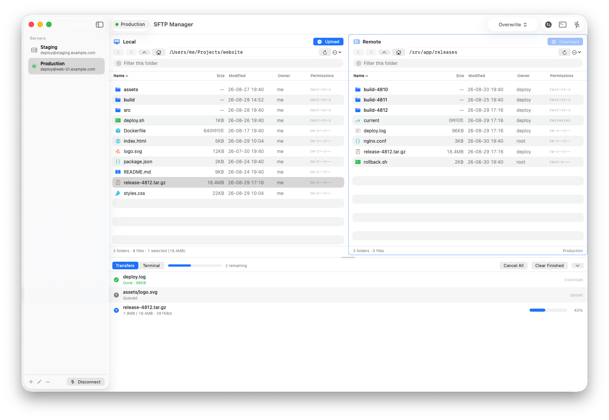
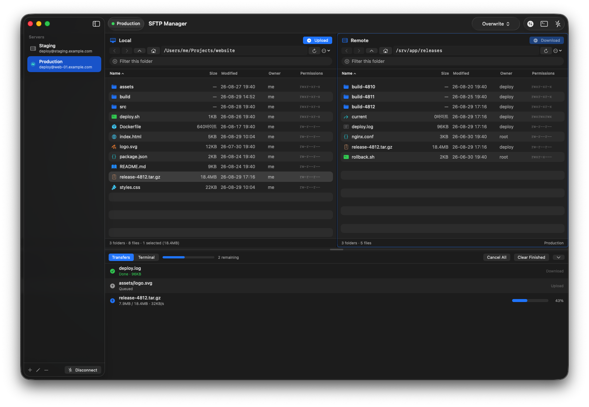
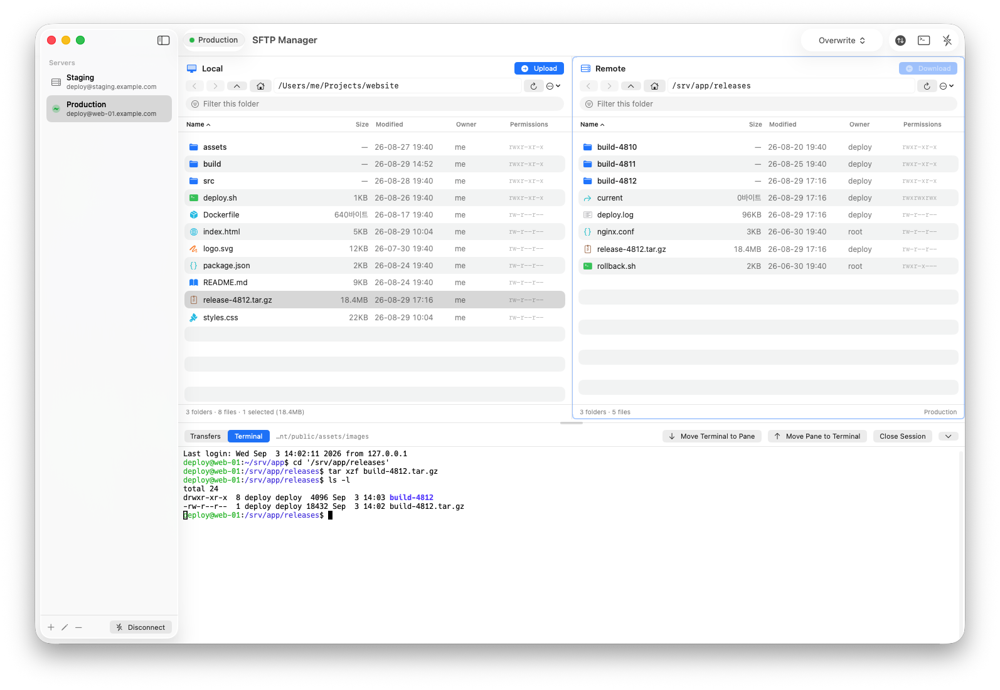
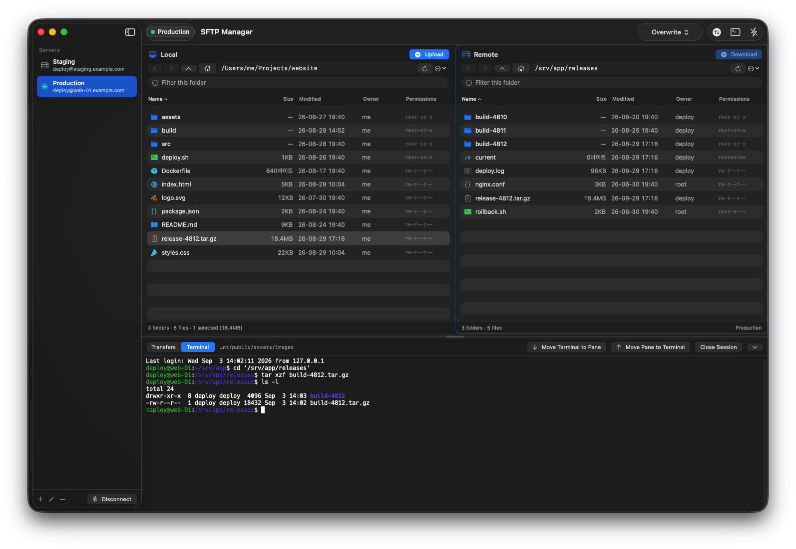

<div align="center">

# SFTP Manager

**A native SFTP file transfer app for macOS**
This Mac on the left, your server on the right. Move files between the two.


**English** · [한국어](README.md)

</div>

| Light | Dark |
|:--:|:--:|
|  |  |
|  |  |

<div align="center"><sup>Above, the two panes and the transfer queue; below, a terminal on that same connection. The window is running with <code>--demo</code>, so every server, path and transfer in it is invented. The theme is a setting — system, light or dark.</sup></div>

---

## Contents

[✨ Features](#features) · [⌨️ Shortcuts](#shortcuts) · [🧱 Tech stack](#stack) ·
[🧰 Development and build](#build) · [⚠️ Installing and running it on macOS](#macos) ·
[📄 License](#license)

---

<a id="features"></a>

## ✨ Features

### 🗂️ Two-pane file browser

- **Split view** — local on the left, remote on the right. Each pane has back / forward / parent / home,
  direct path entry, and a name filter
- **Columns** — name · size · modified · owner · permissions. Click a header to sort, click again to
  reverse (folders first)
- **File operations** — new folder, rename, delete (recursive on the remote side), copy path, show in Finder
- **Right-click empty space** — a menu for the current folder: new folder, refresh, open in Finder,
  upload/download the selection, copy path, go up/home, toggle hidden files, select all

### ⇅ Transfers

- **How to send** — the buttons (`⌘→` / `⌘←`), dragging between the panes, or dragging straight from
  Finder onto the remote pane
- **Whole folders** — the subtree is mirrored as-is
- **Transfer queue** — progress and speed, cancel one or all, retry what failed
- **When a name clashes** — the default is **Ask**. Both files' size and date are shown side by side.

  | Choice | Result |
  |---|---|
  | Overwrite | Replaces the existing file |
  | Keep Both | Saves it as `report 2.pdf` |
  | Skip | Passes over that one item |
  | Cancel | Stops without queueing anything |

  If several names clash, `Apply to the remaining N` answers the rest in one go. To always do the same
  thing, pin a policy from the toolbar or Settings.

- **Double-click** — a local file **uploads by default**. To switch it to `Open with Default App`, use
  the `…` menu in the local pane or the menu bar's `Transfers › Double-click a local file`. Folders
  navigate either way.

<details>
<summary><b>Transfer speed</b> — request pipelining and the SSH channel window</summary>

<br>

Sending one request at a time and waiting for each reply costs a round trip every 32 KB, which caps the
rate at `32 KB / RTT`. Now 64 requests are in flight, and the channel receive window swift-nio-ssh sets
to 128 KB is raised to 2 MB, the same as OpenSSH. **That window is why downloads were so much slower
than uploads.**

| Condition | Before | Now |
|---|---:|---:|
| 40 ms RTT · 8 MB upload | 0.7 MB/s | **24.5 MB/s** |
| 40 ms RTT · 8 MB download | 0.7 MB/s | **16.0 MB/s** |
| Loopback · 64 MB upload | 237.8 MB/s | **473.7 MB/s** |
| Loopback · 64 MB download | 248.6 MB/s | **344.6 MB/s** |

<sup>Under the same conditions <code>scp</code> manages 8.8 MB/s and 202.5 MB/s respectively</sup>

</details>

### 📝 Editing remote files

Right-click a remote file → `Open in Editor`. A scratch copy is downloaded and handed to your default
editor, and **every save uploads it again.** Open files are managed from the `Editing` menu in the
toolbar; stopping deletes the scratch copy.

### 💻 Terminal

The `Terminal` toolbar button or `View › Terminal` (`⌥⌘S`) opens a shell in the bottom panel.
It is a **second channel on the very SSH connection the file panes use**, which means:

- no second password prompt, and no second host key check
- the server does not see a second login
- it closes with the connection

It starts in the folder the remote pane is showing, and reloads the remote listing once a command
finishes and the output falls quiet. `Move Terminal to Pane` / `Move Pane to Terminal` line the two up;
the second one only uses a location the shell **volunteered** (an OSC 7 report, or failing that the
`user@host:path` in its window title) — no command is ever typed into your terminal to find out.
Typing `exit` ends the shell but leaves the screen in place, and `Reopen` starts a new one.

### 🔐 Security

- **Passwords are never stored** — you enter one on each connection and it stays in memory only.
  Nothing is written anywhere, Keychain included. For a private key only the **path** is saved, and you
  are asked for a passphrase only when the key file is actually encrypted. Credentials an older version
  put in the Keychain are deleted once, on first launch.
- **Host key verification** — servers are checked against `~/.ssh/known_hosts`, the same file `ssh`
  uses. A new server shows its SHA256 fingerprint for approval, a changed key raises a warning next to
  the old fingerprint, and a `@revoked` key is refused. This happens during key exchange, so **nothing
  is sent to the server before you approve.**
- **Nothing the server sends is trusted** — a path handed to the shell is always single-quoted (with
  `'\''` escaping), names containing `/`, `.`, `..` or a NUL byte are dropped from the listing, and even
  when a whole folder is downloaded every path is checked to be inside the folder you picked; anything
  that escapes is left in the queue as a failure.

### 🌐 Language, help and settings

- **English / Korean** — picked on the first Settings tab. **It changes immediately; no relaunch.**
  With nothing stored yet, a first launch follows the language macOS is set to.
- **Help (`⌘?`)** — seven topics in both languages: getting started, browsing, transfers, editing
  remote files, terminal, shortcuts, and security.
- **Fonts** — Settings › Fonts picks the interface font and its size, and the terminal's font and size,
  separately. Only fixed-pitch families are offered for the terminal, and a Nerd Font family also draws
  the icon glyphs a shell prompt uses. Nothing is bundled; the list is what the Mac already has.
- **Settings (`⌘,`)** — General (language, theme, password policy) / Fonts (interface, terminal) /
  File Lists (hidden files, default sort, double-click action) / Transfers (clash default, open the
  queue at launch, notify on finish, concurrent requests) / Advanced (edit polling, paths, reset) / About

---

<a id="shortcuts"></a>

## ⌨️ Shortcuts

| Key | Action |
|---|---|
| `⌘N` | New connection |
| `⌘,` | Settings |
| `⌘?` | Help |
| `⌘→` | Upload |
| `⌘←` | Download |
| `⌘R` | Refresh the clicked pane |
| `⇧⌘R` | Refresh both panes |
| `⌘↑` | Local parent folder |
| `⇧⌘↑` | Remote parent folder |
| `⌥⌘T` | Show/hide the transfer list |
| `⌥⌘S` | Show/hide the terminal |

`⌘R` refreshes **only the pane you last clicked** — the highlighted border shows which one.

---

<a id="stack"></a>

## 🧱 Tech stack

| Area | What |
|---|---|
| Language · UI | Swift 6 (language mode 5) · SwiftUI, with `NSViewRepresentable` for AppKit |
| Concurrency | actor-backed sessions, a `@MainActor` UI, progress callbacks coalesced into 100 ms buckets |
| Build | a SwiftPM executable plus a hand-assembled `.app` bundle (no Xcode) |
| Minimum | macOS 15 |

| Package | License | Used for |
|---|---|---|
| [Citadel](https://github.com/orlandos-nl/Citadel) | MIT | SSH connection, SFTP, PTY channel |
| [SwiftTerm](https://github.com/migueldeicaza/SwiftTerm) | MIT | ANSI/vt100 emulation in the terminal panel |

Everything else (swift-nio, swift-crypto, swift-log, swift-collections, BigInt and so on) is pulled in
by those two.

> [!NOTE]
> The SSH transport does not come from `apple/swift-nio-ssh` but from the
> [`Wellz26/swift-nio-ssh`](https://github.com/Wellz26/swift-nio-ssh) fork. That is not this app's
> choice — **Citadel 0.12.1 declares it in its own `Package.swift`** (the fork adds certificate
> authentication and Mac Catalyst support). It is worth stating plainly in an SSH client. The exact
> version and commit are pinned in `Package.resolved`.

---

<a id="build"></a>

## 🧰 Development and build

**Building from source is the recommended way to install this.** There is a
[0.0.1 preview build](https://github.com/wawds123/sftp-manager/releases/tag/v0.0.1) (universal, 8.9 MB)
for convenience, but it is ad-hoc signed rather than notarized, so macOS quarantines it on download and
you have to clear that by hand (→ [notes for macOS](#macos)). Building it yourself skips all of that.

### What you need

| Tool | Requirement |
|---|---|
| macOS | 15 or later — the PTY API the remote shell uses starts there |
| Swift | 6.x, which ships with the Command Line Tools. **Xcode is not required** |

If `swift --version` does not answer, install the Command Line Tools:

```bash
xcode-select --install
```

### Build and run

```bash
git clone https://github.com/wawds123/sftp-manager.git
cd sftp-manager

./Scripts/make_icon.sh     # draws Resources/AppIcon.icns (once)
./Scripts/make_app.sh      # produces build/SFTPManager.app
open build/SFTPManager.app
```

The first build fetches the dependencies and compiles them, so give it a few minutes; later builds are
incremental. `.build/` grows to a few GB and is ignored by git — delete it any time. To move the app out
of the source tree: `mv build/SFTPManager.app /Applications/`.

### Options

```bash
./Scripts/make_app.sh --universal   # arm64 + x86_64 in one bundle
./Scripts/make_app.sh debug         # debug build, symbols kept
swift run SFTPManager               # run straight from the build directory
swift run SFTPManager --demo        # a window full of invented data, for screenshots
```

`--demo` opens the ordinary window with invented servers, listings, transfers and shell output. It
cannot touch the real state — the connection store points at a scratch file and preferences are not
written — so you can switch themes to frame a shot and still have your settings afterwards. The
pictures in this README are the same data, drawn offscreen.

A release build is stripped before signing, which roughly halves it (18.8 MB → 9.0 MB per slice).
`swift build --arch a --arch b` needs Xcode's build system, so `--universal` builds the second
architecture with an explicit target triple and joins the slices with `lipo`.

### Verification

There is no XCTest in a Command Line Tools install, so this repo uses a **runnable self-test** instead.

```bash
# pure logic — path handling, sorting/filtering/history, shell logic, translations, drag payloads
swift run SFTPManager --selftest

# against a real server: upload → list → download (byte for byte) → rename → walk → recursive delete
swift run SFTPManager --selftest \
    --host 127.0.0.1 --port 2222 --user "$USER" --key ~/.ssh/id_ed25519

# throughput (transfers the given size each way and prints MB/s)
swift run SFTPManager --selftest \
    --host 127.0.0.1 --port 2222 --user "$USER" --key ~/.ssh/id_ed25519 --bench-mb 64

# fails on any Korean string still hard-coded into a view or a model
./Scripts/check_l10n.sh
```

<details>
<summary><b>Checking what the UI renders — offscreen snapshots</b> (no screen-recording permission needed)</summary>

<br>

```bash
swift run SFTPManager --snapshot /tmp/ui.png                       # the whole window
swift run SFTPManager --snapshot /tmp/settings.png --view settings --tab advanced

# fixed sample data — reads neither your home directory nor your saved servers
swift run SFTPManager --snapshot /tmp/demo.png --demo

# the help and about windows, in a chosen language and topic
swift run SFTPManager --snapshot /tmp/help.png --view help --lang en --topic terminal

# the window frame (title bar, toolbar) included, at 2x
swift run SFTPManager --snapshot /tmp/window.png --demo --chrome --scale 2
```

Snapshots are drawn into a fixed-size container and clipped — the same condition as a real window, so
layout that overflows shows up as overflow. `--chrome` trades that fixed-size check for the real window
frame, so it is for screenshots rather than for layout checks. Nothing drawn with `--demo` contains a
home directory path or a saved server.

</details>

---

<a id="macos"></a>

## ⚠️ Installing and running it on macOS

- **An app you built yourself is not blocked.** `make_app.sh` ad-hoc signs it, and because it was not
  downloaded it carries no quarantine attribute.
- **A `.zip` you got from somewhere else** is an un-notarized app, and Gatekeeper will silently refuse
  to launch it. Allow it once with **right-click → Open** in Finder, or strip the attribute yourself:
  ```bash
  xattr -dr com.apple.quarantine /Applications/SFTPManager.app
  ```
- **A server you connect to for the first time needs its fingerprint approved.** When the SHA256
  fingerprint appears, check it against `ssh-keygen -lf /etc/ssh/ssh_host_ed25519_key.pub` on the
  server before approving. Approving writes it to `~/.ssh/known_hosts`.
- **You type the password every time.** Nothing is stored by design, and it is not cached within a
  session either.
- **RSA keys are not recommended.** The backend (Citadel) only signs with the legacy `ssh-rsa`
  algorithm, which OpenSSH 8.8 and later reject by default. **Use an ED25519 key.** If you must use
  RSA, the server needs `PubkeyAcceptedAlgorithms +ssh-rsa` in `sshd_config`; the app detects this case
  and says so in the error. Encrypted keys are supported for ED25519 and RSA only, not ECDSA.
- **The language switch does not reach everything.** Every screen the app draws itself changes
  immediately, but the menu items macOS supplies (`Quit`, `Hide`, `Services`, and the Edit and Window
  menus) follow the system language. That is the cost of an in-app string table instead of `.lproj`
  bundles — in exchange, the switch needs no relaunch.
- **Servers that block shells** (`ForceCommand internal-sftp` and the like) will not open a terminal.
- **Local-to-local copying** is not supported.
- **The queue transfers one file at a time.** A single file moves at the rates above, but a folder full
  of very small files is still slow, because each one needs its own open/close round trip.

---

<a id="license"></a>

## 📄 License

MIT — see [LICENSE](LICENSE).
